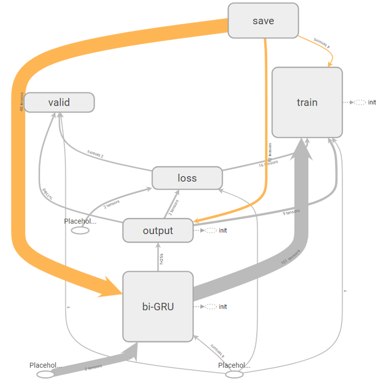
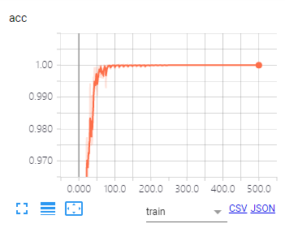
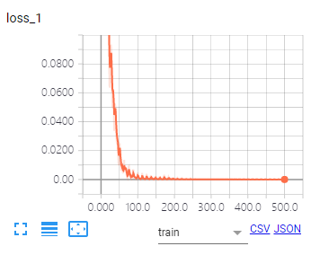

# SecurityEntityRecognition

Dynamic Bi-GRU for Security Entity & Relation Recognition

## Requirements

- python >= 3.x
- jupyter >= 1.0.0
- tensorflow >= 1.4.0
- tensorflow-tensorboard >= 0.4.0

## Files Introduction

1. scrapy_zerodayinitiative.py
  - scrapy html to dir zerodayinitiative
  - website: http://www.zerodayinitiative.com/advisories/published/
2. html2csv
  - analyze html to csv
  - CVE ID, CVSS Score, Affected Vendors, Affected Products, Vulnerability Details, Vendor Response, Disclosure Timeline, Credit, filename
3. html2data
  - label data, encoding data, padding
4. html2tf
  - bi-GRU 99.8584

## Result

- Computer Graph

- Acc & Loss

